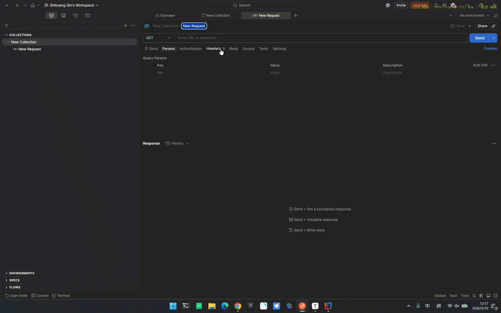
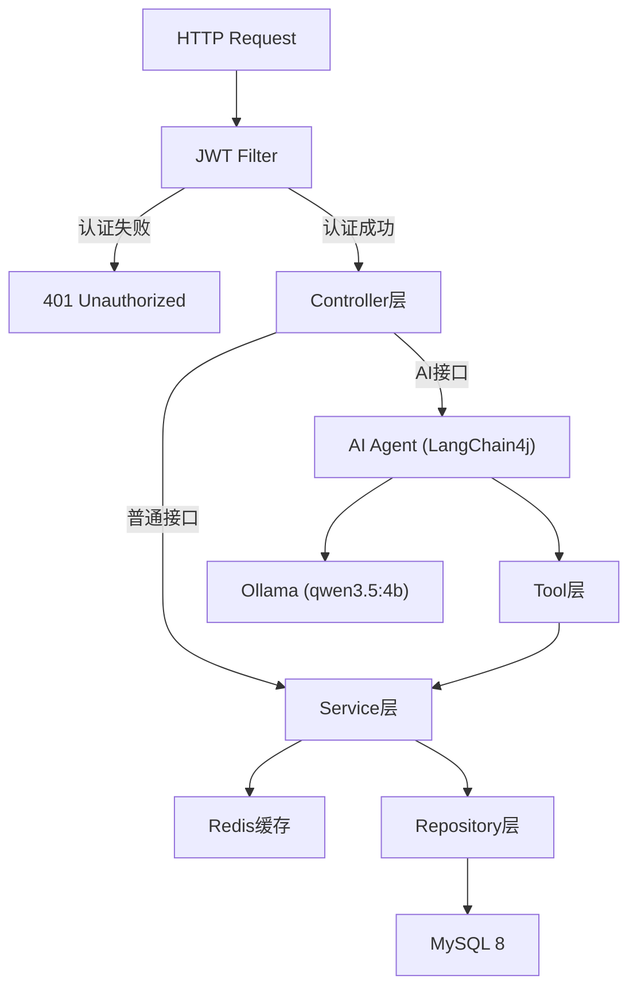

# CampusAI | 校园智能体

## 📖 项目简介 (Introduction)

一个在学生管理系统基础上构建的 Java 后端项目，不止于 CRUD，集成了 Spring Boot 生产级工程实践（JWT鉴权、Redis缓存、动态查询）和 LangChain4j Tool-Calling Agent，LLM 自主决策调用Tools。

## 🌐 公网地址

> 纯后端 REST API，需通过 Postman 等工具调用。先 `POST /students/login` 获取 JWT token，再访问其他接口。

> AI 接口依赖本地 Ollama，公网部署暂不包含 LLM 服务。
- **Base URL**: https://campusai-production-093d.up.railway.app

## 🚀 进化路线图 (Roadmap)

- [x] **Phase 0**：环境配置 + GitHub Actions CI ✅
- [x] **Phase 1**：Spring Boot 骨架 + Docker + MySQL + Java 21 虚拟线程验证 ✅
- [x] **Phase 2**：Tool-Calling Agent —— LangChain4j + Ollama + 4个业务Tool + 结构化输出 + 多轮记忆 ✅
- [x] **Phase 3**：DTO/VO分层 + 全局异常 + 参数校验 + 分页排序 + 事务进阶 + Redis缓存 + JWT鉴权 + Spring Security + CI/CD + 公网部署 ✅
- [ ] **Phase 4**：Multi-Agent + RAG —— Supervisor Agent + Specialist Agent + 向量检索 + Redis持久化记忆 🚧
- [ ] **Phase 5**：Prometheus + Grafana可观测性 + Resilience4j限流熔断 + 压测报告

## 🛠️ 技术栈 (Tech Stack)

- **后端 (Backend)**: Java 21 (虚拟线程), Spring Boot 4.0.5, JPA.
- **数据库 (Database)**: MySQL.
- **工具 (Tools)**: Docker, docker-compose, Maven, GitHub Actions.
- **AI框架 (AI)**: LangChain4j 1.13.0-beta23, Ollama (qwen3.5:4b)
- **安全 (Security)**: JWT(JJWT 0.12.6), Spring Security
- **缓存 (Cache)**: Redis

## 🐳 快速启动 (Quick Start)

1. 复制配置文件: `cp docker-compose.example.yml docker-compose.yml`
2. 修改 `docker-compose.yml` 里的密码
3. 一键启动: `docker-compose up --build`

## 🎬 演示 (Demo)

> 本地演示，AI接口依赖本地 Ollama

## 📡 API 接口 (Endpoints)

**认证**

| Method | URL             | 说明                        |
| ------ |-----------------| --------------------------- |
| POST   | /students/login | 登录，返回 JWT token        |

**学生管理**

| Method | URL             | 说明         |
| ------ | --------------- | ------------ |
| GET    | /students       | 获取学生列表（支持姓名/班级/年龄/课程名动态筛选，分页排序） |
| GET    | /students/{id}  | 获取单个学生 |
| POST   | /students       | 添加学生     |
| PUT    | /students/{id}  | 修改学生信息 |
| DELETE | /students/{id}  | 删除学生     |

**课程管理**

| Method | URL             | 说明         |
| ------ | --------------- | ------------   |
| GET    | /courses        |获取课程列表（支持课程名/学分区间动态筛选）|

**AI Agent**

| Method | URL      | 说明                    |
| ------ | -------- | ----------------------- |
| POST   | /ai/ask  | 向 Agent 发送自然语言指令 |

## 🏗️ 系统架构 (Architecture)

- **普通接口**：Controller → Service → Repository → MySQL
- **AI接口**：Controller → AI Agent（理解意图 + 自主规划）→ Tool → Service → Repository → MySQL

## ⚡ Virtual Threads

- 技术：Java 21 Virtual Threads
- 问题：传统平台线程在高并发 I/O 阻塞时，什么都干不了，大量并发就需要大量线程，浪费资源
- 解决：阻塞时自动卸载，平台线程去干别的，资源利用率大幅提升
- 验证：通过 VisualVM 对比线程视图，确认虚拟线程与平台线程的差异